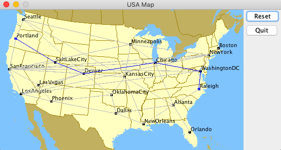

# TravelPaths

## Computes shortest paths with airlines between cities using Dijkstra's algorithm efficiently using a Priority Queue

### Reads city distances and locations from USA.txt, and displays them in a GUI. Click two cities to display the shortest path between in blue

